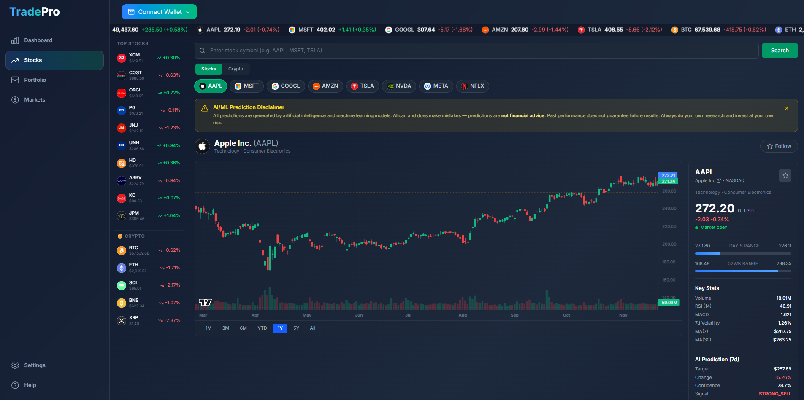
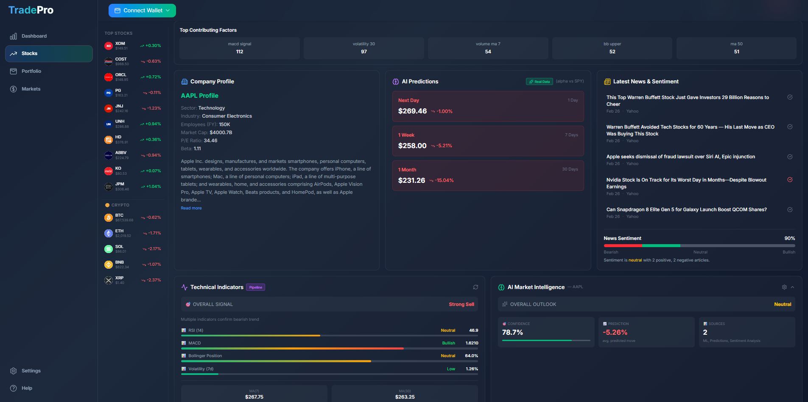
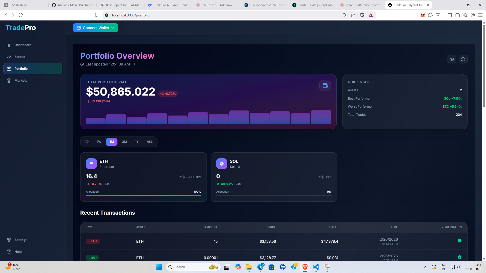
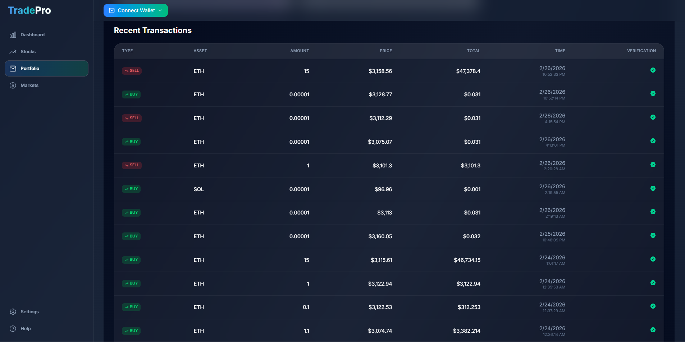
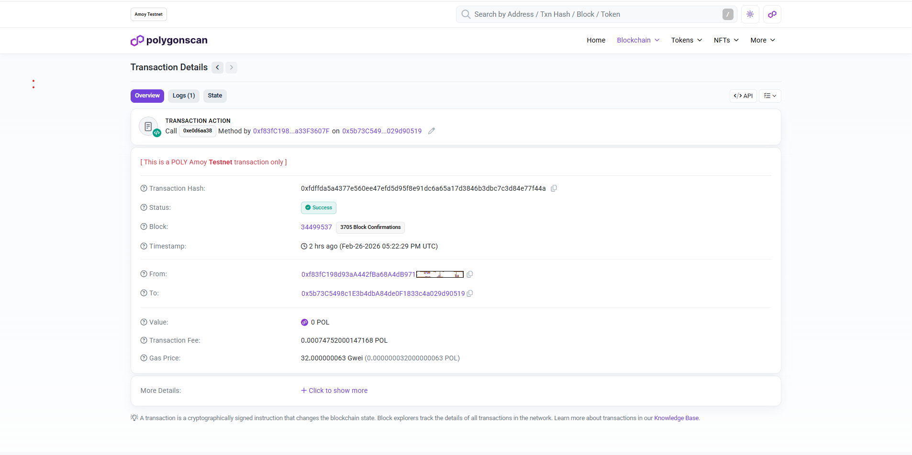

# 🚀 TradePro — AI-Powered Blockchain-Verified Trading Platform
<!-- <p align="center"> -->
  <!-- 
  
  
  
  
   -->


<!-- </p> -->

<p align="center">
  <a href="https://www.typescriptlang.org/"></a>
  <a href="https://soliditylang.org/"></a>
  <a href="https://nextjs.org/"></a>
  <a href="https://book.getfoundry.sh/"></a>
  <a href="https://www.mongodb.com/"></a>
  <a href="https://opensource.org/licenses/MIT"></a>
</p>

<p align="center">
  <b>A full-stack hybrid crypto trading platform that delivers CEX-level speed with DEX-level transparency, powered by a 5-agent AI system.</b>
</p>

<p align="center">
  <!-- <a href="#">🔗 Live Demo</a> · <a href="#">🎬 Video Walkthrough</a> · -->
  <a href="./contracts/README.md">📜 Contracts</a> ·
  <a href="./backend/README.md">⚙️ Backend</a> ·
  <a href="./frontend/README.md">🎨 Frontend</a> ·
  <a href="./ml_backend/README.md">🤖 ML Engine</a>
</p>

---

<!-- HERO SCREENSHOT -->
<p align="center">
  
  <br />
  <em>TradePro Dashboard — Live candlestick charts, order book, quick trade cards, and real-time market stats</em>
</p>

---

## 📋 Table of Contents

- [Why TradePro?](#-why-tradepro)
- [Key Features](#-key-features)
- [Platform Screenshots](#-platform-screenshots)
- [System Architecture](#-system-architecture)
- [How a Trade Works](#-how-a-trade-works--end-to-end)
- [Tech Stack](#-tech-stack)
- [Project Structure](#-project-structure)
- [Getting Started](#-getting-started)
- [Environment Variables](#-environment-variables)
- [Security Design](#-security-design)
- [Roadmap](#-roadmap)
- [License](#-license)

---

## ❗ Why TradePro?

Modern crypto trading is broken into two extremes:

| | Centralized Exchange (CEX) | Decentralized Exchange (DEX) | **TradePro (Hybrid)** |
|---|---|---|---|
| **Speed** | ✅ ~10ms | ❌ 2-15s block time | ✅ Off-chain execution |
| **Transparency** | ❌ Opaque order matching | ✅ Fully on-chain | ✅ On-chain proof per trade |
| **Custody** | ❌ Exchange holds keys | ✅ User holds keys | ✅ Non-custodial (MetaMask / WalletConnect) |
| **Gas Cost** | ✅ None | ❌ Every action costs gas | ✅ Only verification on-chain |
| **Auditability** | ❌ Trust the operator | ✅ Inspect any block | ✅ keccak256 hash chain |
| **Intelligence** | ❌ Rarely built-in | ❌ None | ✅ 5-agent AI system |

**TradePro fills the gap** — it executes trades off-chain for speed, then anchors a cryptographic proof of every trade on-chain via a `TradeVerifier` smart contract. A multi-agent AI system provides data-driven market intelligence. The user keeps custody of their wallet at all times.

---

## ✨ Key Features

| Category | Feature | Detail |
|---|---|---|
| 🏦 **Trading** | Quick Trade & Advanced Form | One-click trading for BTC/USD, ETH/USD, SOL/USD with Market & Limit orders |
| 💰 **Settlement** | Real ETH Movement | BUY deducts ETH from wallet → Treasury. SELL sends ETH proceeds back to user |
| 🔗 **Blockchain** | On-Chain Verification | Every trade is `keccak256`-hashed and stored on-chain with a tamper-evident hash chain |
| 🌳 **Blockchain** | Merkle Batch Proofs | Batch N trades into a single Merkle root for O(1) gas cost |
| 🤖 **AI** | 5-Agent Analysis System | Technical, Fundamental, Sentiment, Macro, and Risk agents provide weighted recommendations |
| 📈 **AI** | LightGBM Price Prediction | 30+ engineered features, multi-horizon forecasts (1d/7d/30d), confidence scoring |
| 🔐 **Auth** | Sign-In with Ethereum | Passwordless login via wallet signature (EIP-191 nonce-based, anti-replay) |
| 📊 **Dashboard** | Real-time Market Data | Live prices via Binance WebSocket stream, interactive candlestick charts, order book |
| 💼 **Portfolio** | Holdings & P&L Tracker | Cost-basis calculation, real-time P&L, allocation breakdown, full transaction history |
| ✅ **Trust** | Verification Badges | Every transaction displays a "Verified ✓" badge linking to the on-chain proof |

---

## 📸 Platform Screenshots

> **Add your own screenshots here.** These are the recommended images:

### 1. Trading Dashboard
<!-- Replace the path with your actual screenshot -->
<p align="center">
  
</p>
<p align="center"><em>The main dashboard with live price charts, order book, quick trade cards, and market stats.</em></p>

### 2. AI-Powered Stock & Crypto Analysis
<p align="center">
  
</p>
<p align="center">
  
</p>
<p align="center"><em>The <code>/stocks/[symbol]</code> page showing multi-agent analysis, LightGBM predictions, sentiment, and candlestick charts.</em></p>

### 3. Portfolio & Transaction History
<p align="center">
  
</p>
<p align="center">
  
</p>
<p align="center"><em>The portfolio view: asset holdings, cost basis, P&L, allocation %, and each trade's blockchain verification badge.</em></p>

### 4. Trade Execution & Blockchain Verification
<p align="center">
  
</p>
<p align="center"><em>A real trade verified on <b>Polygon Amoy Testnet</b> — transaction hash, block confirmation, and on-chain proof visible on <a href="https://amoy.polygonscan.com/tx/0xfdffda5a4377e560ee47efd5d95f8e91dc6a65a17d3846b3dbc7c3d84e77f44a">PolygonScan</a>.</em></p>

---

## 🏗 System Architecture

TradePro runs as **four independent services** communicating over REST, WebSocket, and JSON-RPC:

```
┌─────────────────────────────────────────────────────────────────────────┐
│                            USER (Browser + MetaMask)                    │
└───────────────────┬────────────────────────────┬────────────────────────┘
                    │                            │
          REST + WebSocket                  Wallet RPC (JSON-RPC)
                    │                            │
┌───────────────────▼──────────┐   ┌─────────────▼──────────────────────┐
│     🎨 FRONTEND (Port 3000)  │   │   🔗 BLOCKCHAIN                    │
│     Next.js 16 · React 19    │   │   Polygon Amoy (Chain ID: 80002)   │
│     Tailwind CSS · wagmi     │   │                                     │
│                              │   │   TradeVerifier.sol                 │
│  Pages: Dashboard, Stocks,   │   │   ├─ verifyTrade()                 │
│  Portfolio, Markets, Settings│   │   ├─ batchVerify()                  │
│  Help, Not-Found             │   │   ├─ submitMerkleRoot()             │
│                              │   │   └─ getTradeProof()               │
│  Real-time: Socket.IO client │   │                                     │
│  Wallet: WalletConnect +     │   │   Deployed:                         │
│          MetaMask + Coinbase │   │   0xf24d...c640 (Polygon Amoy)     │
└───────────────────┬──────────┘   └─────────────▲──────────────────────┘
                    │                            │
               REST API                     ethers.js v6
                    │                            │
┌───────────────────▼────────────────────────────┴──────────────────────┐
│                    ⚙ BACKEND (Port 5000)                              │
│                    Express.js 5 · TypeScript · Socket.IO              │
│                                                                       │
│  Auth:   Nonce → personal_sign → JWT (30-day)                        │
│  Trade:  Hash trade → verifyTrade() on-chain → Save to MongoDB       │
│  Settle: BUY = user pays ETH · SELL = treasury sends ETH proceeds    │
│  Feed:   Binance WebSocket → Broadcast to all clients                │
│  Faucet: Dev endpoint → sends 5 test ETH to wallet                   │
│                                                                       │
│  Rate limiting: 100 auth/min · 200 trades/min                        │
└───────────────────────────────────┬───────────────────────────────────┘
                                    │ Mongoose
                                    ▼
                        ┌───────────────────────┐
                        │   🗄 MongoDB Atlas     │
                        │   Users · Trades       │
                        └───────────────────────┘

┌───────────────────────────────────────────────────────────────────────┐
│                    🤖 ML BACKEND (Port 8000)                          │
│                    FastAPI · Python · LightGBM                        │
│                                                                       │
│  Agents:   Technical · Fundamental · Sentiment · Macro · Risk        │
│  Predict:  LightGBM with 30+ features · Multi-horizon (1d/7d/30d)   │
│  Data:     yfinance · RSS news feeds · keyword sentiment             │
│  Output:   STRONG_BUY / BUY / HOLD / SELL / STRONG_SELL             │
└───────────────────────────────────────────────────────────────────────┘
```

> 📖 **Deep-dive documentation for each layer:**
> [Contracts](./contracts/README.md) · [Backend](./backend/README.md) · [Frontend](./frontend/README.md) · [ML Backend](./ml_backend/README.md)

---

## ⚡ How a Trade Works — End to End

This is the core innovation. Here's exactly what happens when a user buys 0.5 BTC at $51,000:

```
Step 1: User clicks BUY 0.5 BTC @ $51,000
        Frontend calculates cost: (0.5 × 51000) / ETH_PRICE ≈ 8.23 ETH

Step 2: MetaMask popup → User signs ETH transfer to Treasury wallet
        User's wallet: 10.0 ETH → 1.77 ETH

Step 3: Frontend POSTs to /api/trades/verify with JWT

Step 4: Backend computes deterministic keccak256 hash:
        hash = keccak256(abi.encodePacked(symbol, side, price, qty, wallet, timestamp))

Step 5: Backend calls TradeVerifier.verifyTrade(hash, trader) on-chain
        → Contract stores hash with timestamp, block#, and previousHash
        → Emits TradeVerified event
        → Returns transaction hash

Step 6: Backend saves full trade metadata to MongoDB
        (symbol, side, price, quantity, tradeHash, txHash, blockNumber, userId)

Step 7: Backend updates user stats (tradeCount++, totalVolume += value)

Step 8: Frontend receives response → dispatches 'portfolio_updated' event
        → Portfolio page re-fetches trades and recalculates P&L
        → Wallet balance auto-refreshes
        → "Verified ✓" badge appears on the trade
```

**For SELL orders:** The backend calculates the ETH proceeds and sends them from the Treasury to the user's wallet via `ethers.sendTransaction()`. No MetaMask popup is needed.

---

## 🛠 Tech Stack

| Layer | Technology | Purpose |
|---|---|---|
| **Frontend** | Next.js 16, React 19, TypeScript | Server-side rendering, App Router |
| | Tailwind CSS 4, Framer Motion | Styling, animations |
| | wagmi 3, viem 2, ethers.js 6 | Wallet connection, chain interaction |
| | TradingView Lightweight Charts | Professional candlestick + volume charts |
| | TanStack React Query | Server state caching with stale-while-revalidate |
| | Socket.IO Client | Real-time price streaming |
| **Backend** | Express.js 5, TypeScript 5.9 | REST API framework |
| | ethers.js 6 | Smart contract interaction |
| | Mongoose 9, MongoDB Atlas | ODM + cloud database |
| | Socket.IO 4 | WebSocket server for Binance data relay |
| | jsonwebtoken, helmet | JWT auth, security headers |
| | express-rate-limit | Rate limiting (auth: 100/min, trades: 200/min) |
| **Blockchain** | Solidity 0.8.13 | Smart contract language |
| | OpenZeppelin v5 | Ownable, ReentrancyGuard, Pausable, MerkleProof |
| | Foundry (Forge, Anvil, Cast) | Compile, test, deploy, interact |
| **ML Engine** | FastAPI, uvicorn | Async Python API server |
| | LightGBM, scikit-learn | Gradient boosting regression |
| | pandas, numpy, ta | Data processing, technical indicators |
| | yfinance, feedparser | Market data, news feeds |

---

## 📁 Project Structure

```
trading-platform/
│
├── contracts/                          # 📜 Smart Contracts (Foundry)
│   ├── src/TradeVerifier.sol           #    Core verification contract
│   ├── test/Tradeverifier.t.sol        #    18 tests + fuzz testing
│   ├── script/Deploy.s.sol             #    Deployment script
│   ├── script/Interact.s.sol           #    Demo interaction script
│   └── README.md                       #    📖 Detailed contract docs
│
├── backend/                            # ⚙ Express.js API Server
│   └── src/
│       ├── server.ts                   #    Entry point + middleware
│       ├── routes/auth.routes.ts       #    SIWE authentication
│       ├── routes/trade.routes.ts      #    Trade execution & history
│       ├── routes/faucet.routes.ts     #    Dev faucet (5 ETH)
│       ├── services/blockchain.service.ts  # ethers.js contract calls
│       ├── services/websocket.service.ts   # Binance WS → Socket.IO
│       ├── models/Trade.model.ts       #    Trade schema
│       ├── models/User.model.ts        #    User schema
│       └── README.md                   #    📖 Detailed backend docs
│
├── frontend/                           # 🎨 Next.js Application
│   └── src/
│       ├── app/                        #    Pages (Dashboard, Stocks, Portfolio, ...)
│       ├── components/                 #    40+ React components
│       ├── context/                    #    Wallet, Auth, Symbol providers
│       ├── hooks/                      #    useRealTimeData, useMLApi, ...
│       ├── config/                     #    Asset registry (30 assets)
│       └── README.md                   #    📖 Detailed frontend docs
│
├── ml_backend/                         # 🤖 Python AI Engine
│   ├── agents/                         #    5 specialized AI agents
│   ├── orchestrator/                   #    Weighted voting system
│   ├── predictor/                      #    LightGBM + sentiment
│   ├── api/routes.py                   #    10+ API endpoints
│   └── README.md                       #    📖 Detailed ML docs
│
├── fund-wallet.sh                      # Helper: fund wallet via Anvil
├── verify-all.sh                       # Integration test script
└── README.md                           # ← You are here
```

---

## 🧪 Getting Started

### Prerequisites

| Tool | Version | Purpose |
|---|---|---|
| [Node.js](https://nodejs.org/) | v20+ | Backend & Frontend runtime |
| [Foundry](https://getfoundry.sh/) | latest | Smart contract toolchain |
| [Python](https://python.org/) | v3.10+ | ML engine runtime |
| [MetaMask](https://metamask.io/) | latest | Browser wallet extension |
| [MongoDB Atlas](https://mongodb.com/atlas) | Free tier | Cloud database |

### Step-by-Step Setup

#### 1️⃣ Clone the Repository
```bash
git clone https://github.com/Abhinav-Malik-154/trading-platform.git
cd trading-platform
```

#### 2️⃣ Deploy the Smart Contract to Polygon Amoy

The contract is **already deployed** on Polygon Amoy testnet:

| Field | Value |
|---|---|
| **Contract** | `TradeVerifier` |
| **Address** | `0xf24dbc76bcda7188734aa472932199c5bd07c640` |
| **Chain** | Polygon Amoy (Chain ID: `80002`) |
| **Block** | `34472399` |
| **Explorer** | [View on PolygonScan](https://amoy.polygonscan.com/address/0xf24dbc76bcda7188734aa472932199c5bd07c640) |

To redeploy or deploy your own instance:
```bash
cd contracts
forge install
forge build
forge script script/Deploy.s.sol \
  --rpc-url $POLYGON_AMOY_RPC_URL \
  --private-key $PRIVATE_KEY \
  --broadcast \
  --verify \
  --etherscan-api-key $POLYGONSCAN_API_KEY
```
> Copy the deployed **contract address** from the output.

> **For local development only:** You can also use Anvil (`anvil`) as a local chain on `http://127.0.0.1:8545` (Chain ID: 31337).

#### 3️⃣ Start the Backend
Open a **new terminal**:
```bash
cd backend
npm install
```
Create `backend/.env`:
```env
RPC_URL=https://rpc-amoy.polygon.technology
PRIVATE_KEY=<your_deployer_private_key>
CONTRACT_ADDRESS=0xf24dbc76bcda7188734aa472932199c5bd07c640
MONGODB_URI=mongodb+srv://<user>:<pass>@<cluster>.mongodb.net/tradingPlatformDB
JWT_SECRET=your-super-secret-key-change-this
PORT=5000
FRONTEND_URL=http://localhost:3000
```
```bash
npm run dev
```
> Backend runs on `http://localhost:5000`.

#### 4️⃣ Start the ML Engine
Open a **new terminal**:
```bash
cd ml_backend
python -m venv venv && source venv/bin/activate
pip install -r requirements.txt
python main.py
```
> ML API runs on `http://localhost:8000`. Docs at `http://localhost:8000/docs`.

#### 5️⃣ Start the Frontend
Open a **new terminal**:
```bash
cd frontend
npm install
npm run dev
```
> Open `http://localhost:3000` in your browser.

#### 6️⃣ Configure MetaMask

1. **Add Polygon Amoy Network**: Settings → Networks → Add Network
   - **Name**: Polygon Amoy Testnet
   - **RPC URL**: `https://rpc-amoy.polygon.technology`
   - **Chain ID**: `80002`
   - **Symbol**: POL
   - **Explorer**: `https://amoy.polygonscan.com`
2. **Get Test POL**: Visit the [Polygon Faucet](https://faucet.polygon.technology/) to get testnet POL tokens.
3. **Get Test ETH (in-app)**: Click the wallet dropdown in the app → "Get 5 Test ETH" (uses the dev faucet endpoint).

> **For local development with Anvil:** Add network with RPC URL `http://127.0.0.1:8545`, Chain ID `31337`, and import an Anvil private key.

---

## 🔐 Environment Variables

### Backend (`backend/.env`)
| Variable | Required | Description |
|---|---|---|
| `RPC_URL` | ✅ | Polygon Amoy RPC endpoint (e.g., `https://rpc-amoy.polygon.technology`) |
| `PRIVATE_KEY` | ✅ | Contract owner / Treasury private key |
| `CONTRACT_ADDRESS` | ✅ | Deployed TradeVerifier address (`0xf24d...c640` on Amoy) |
| `MONGODB_URI` | ✅ | MongoDB Atlas connection string |
| `JWT_SECRET` | ✅ | Secret for signing JWT tokens |
| `PORT` | | Server port (default: `5000`) |
| `FRONTEND_URL` | | CORS origin (default: `http://localhost:3000`) |

### Frontend (`frontend/.env.local`)
| Variable | Required | Description |
|---|---|---|
| `NEXT_PUBLIC_API_URL` | | Backend URL (default: `http://localhost:5000`) |
| `NEXT_PUBLIC_ML_API_URL` | | ML API URL (default: `http://localhost:8000`) |
| `NEXT_PUBLIC_EXPECTED_CHAIN_ID` | | Target chain ID (default: `31337`; use `80002` for Polygon Amoy) |
| `NEXT_PUBLIC_WALLET_CONNECT_PROJECT_ID` | | WalletConnect Cloud project ID |
| `NEXT_PUBLIC_APP_URL` | | App URL for wallet metadata (default: `http://localhost:3000`) |
| `NEXT_PUBLIC_APP_ICON_URL` | | App icon URL for wallet metadata |
| `NEXT_PUBLIC_CRYPTO_LOGO_CDN` | | CDN for cryptocurrency logos |
| `NEXT_PUBLIC_STOCK_LOGO_CDN` | | CDN for stock logos |

### ML Backend (`ml_backend/.env`)
| Variable | Required | Description |
|---|---|---|
| `HOST` | | API host (default: `0.0.0.0`) |
| `PORT` | | API port (default: `8000`) |
| `FRONTEND_URL` | | CORS origin (default: `http://localhost:3000`) |
| `YAHOO_RSS_URL` | | Custom Yahoo Finance RSS feed URL |
| `SEEKING_ALPHA_RSS_URL` | | Custom Seeking Alpha RSS feed URL |

### Contracts (`contracts/.env`)
| Variable | Required | Description |
|---|---|---|
| `POLYGON_AMOY_RPC_URL` | ✅ | Polygon Amoy RPC for Foundry deployments |
| `POLYGONSCAN_API_KEY` | ✅ | API key for contract verification on PolygonScan |
| `PRIVATE_KEY` | ✅ | Deployer private key |
| `CONTRACT_ADDRESS` | | Used by `Interact.s.sol` for on-chain interactions |

---

## 🔒 Security Design

| Layer | Mechanism | Purpose |
|---|---|---|
| **Authentication** | EIP-191 `personal_sign` + nonce | Passwordless login, anti-replay protection |
| **Authorization** | JWT (30-day expiry) | Stateless session management |
| **API Protection** | Helmet + express-rate-limit | Security headers, DDoS mitigation |
| **Smart Contract** | `Ownable` (OpenZeppelin) | Only backend can write verification proofs |
| **Smart Contract** | `ReentrancyGuard` | Prevents reentrancy attacks |
| **Smart Contract** | `Pausable` | Circuit breaker for emergencies |
| **Data Integrity** | Deterministic `keccak256` hash chain | Each proof links to `previousHash` for tampering detection |
| **Verification** | Merkle proofs (OpenZeppelin) | Enables inclusion proofs for batch-verified trades |

---

## 🗺️ Roadmap

- [x] Smart contract with single + batch + Merkle verification
- [x] Hash-chain linking for tamper-evident ordering
- [x] Express.js backend with JWT auth and rate limiting
- [x] MongoDB persistence with Mongoose
- [x] Binance WebSocket → Socket.IO real-time price feed
- [x] Next.js 16 frontend with professional trading UI
- [x] MetaMask + WalletConnect + Coinbase wallet integration
- [x] Real ETH settlement (BUY deducts, SELL credits)
- [x] Portfolio tracker with cost basis and P&L
- [x] 5-agent AI analysis system with weighted voting
- [x] LightGBM multi-horizon price prediction
- [x] 30-asset registry (20 stocks + 10 crypto)
- [x] Verification badges on every trade
- [x] Public testnet deployment (Polygon Amoy — Chain ID 80002)
- [x] Contract verified on PolygonScan
- [x] On-chain trade verification & Merkle batch tested on Amoy
- [x] Dev faucet endpoint (5 test ETH)
- [x] Settings & Help pages
- [x] Multi-wallet provider support (WalletConnect, Injected, Coinbase)
- [x] Trade notifications via WebSocket push
- [x] Mobile-responsive optimizations
- [ ] Limit order matching engine
- [ ] Multi-chain support (Polygon mainnet, Ethereum L2s)

---

## 📄 License

This project is licensed under the **MIT License**.

---

<p align="center">
  Built by <a href="https://github.com/Abhinav-Malik-154"><b>Abhinav Malik</b></a>
</p>
